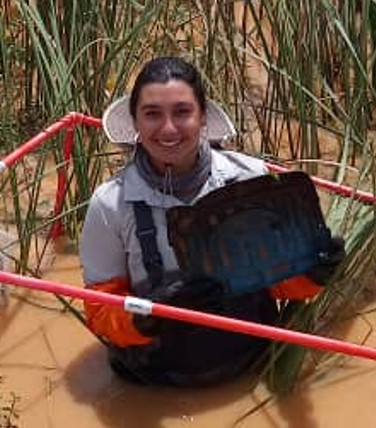

::: {.hero-about style="--hero-image: url('images/home-landscape.jpg');"}

::: {.hero-portrait}

:::

::: {.hero-text}
# Kaitlyn Rose Mitchell

I study how ecological change shapes health across organisms, ecosystems, and communities.

My work combines field ecology, spatial modeling, biological data, uncertainty analysis, and community-engaged research to understand environmental change, disease systems, and biological response.

[Explore research](research.qmd){.btn .btn-light .btn-lg}
:::

:::