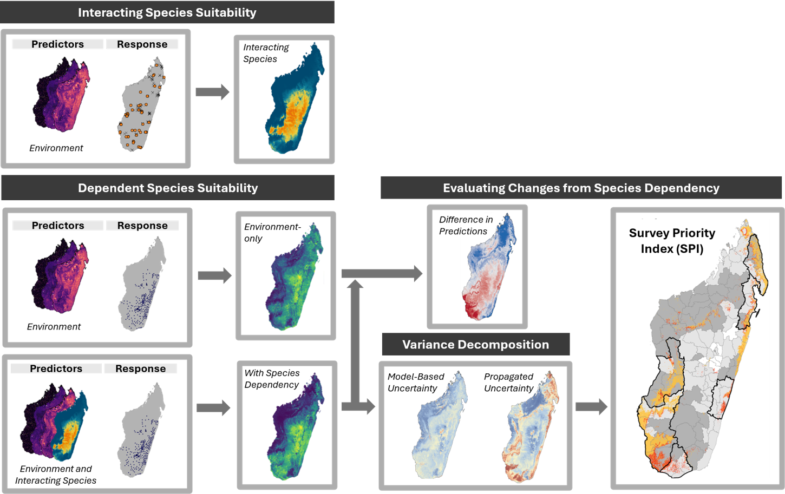
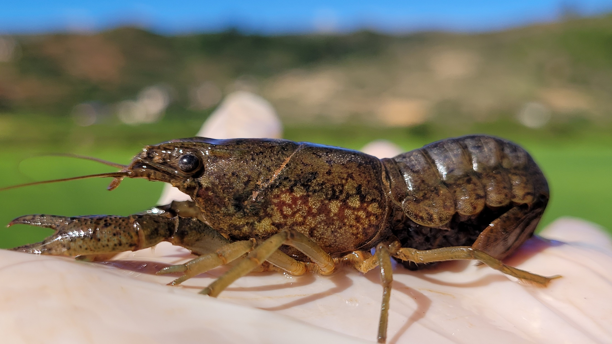
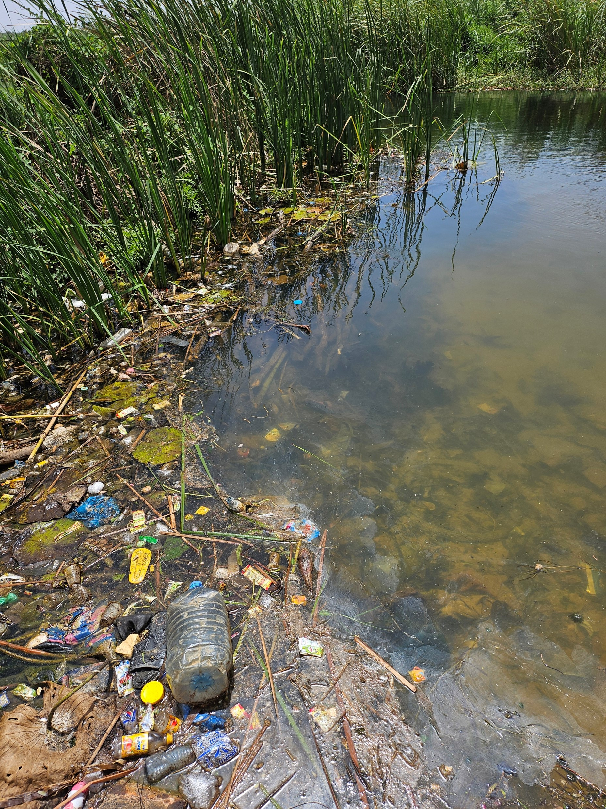
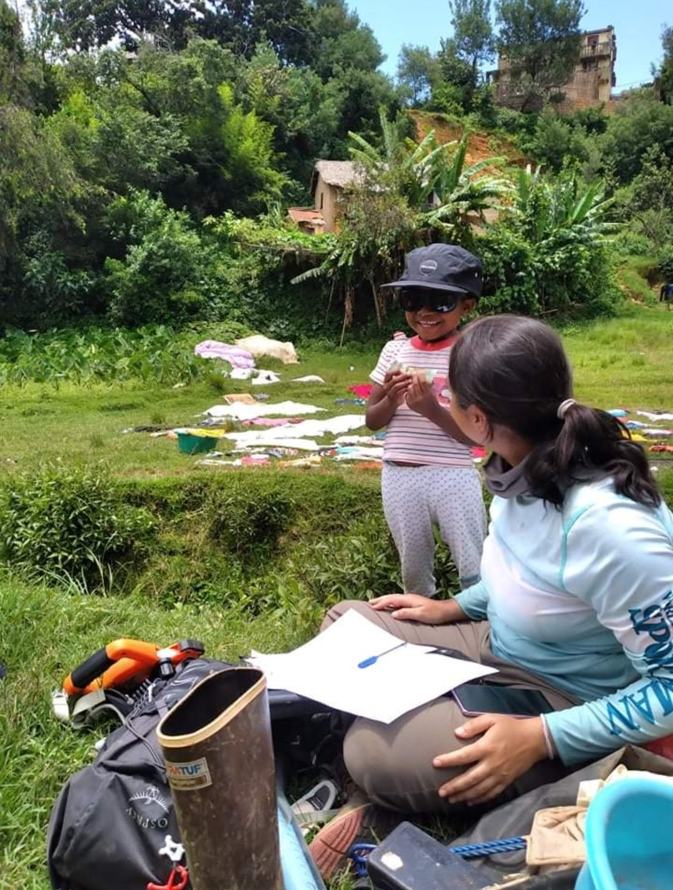

This page brings together selected projects across the three major scales of my research: landscape-scale modelling, local social-ecological change, and organismal responses to stress.

## Spatial modelling for conservation and health {#spatial-modelling-projects}

::: {.project-list}

::: {.project-card}

::: {.project-card-body}
### [Propagating uncertainty from biotic interactions in species distribution models guides multispecies survey design](https://scholar.google.com/citations?view_op=view_citation&hl=en&user=cPw4-VgAAAAJ&citation_for_view=cPw4-VgAAAAJ:eQOLeE2rZwMC)

Many species depend on other species to survive, but these dependencies are often missing from spatial occurrence models. I used schistosomiasis parasites and their freshwater snail hosts as a case study to examine how ecological dependencies can improve spatial predictions of species occurrence. By mapping host suitability and propagating uncertainty across linked species, this work highlights where interacting species can enhance prediction, guide surveillance, and support conservation and public health decisions.
:::
:::

::: {.project-card}

::: {.project-card-body}
### Prolific invader disrupts ecology of a human parasitic disease

Invasive species do not spread randomly across landscapes; they move through environmental gradients, human transport routes, and ecological opportunity. I used spatial models to predict where invasive marbled crayfish (*Procambarus virginalis*) may spread in Madagascar and where their suitable habitat overlaps with schistosomiasis risk. By mapping these joint suitability landscapes, this work identified places where ecological invasion and human health concerns may intersect.
:::
:::

:::

### Other work

- Re-assessing thermal response of schistosomiasis transmission risk: Evidence for a higher thermal optimum than previously predicted

---

## Environmental disturbance in social-ecological systems {#environmental-disturbance-projects}

::: {.project-list}

::: {.project-card}

::: {.project-card-body}
### Prolific invader disrupts ecology of a human parasitic disease

Invasive species can reorganize ecosystems in ways that are difficult to predict, especially when they alter the abundance or distribution of species that matter for human health. In Madagascar, I study the spread of invasive marbled crayfish and their relationship with freshwater snails, including the intermediate hosts of schistosomiasis. This work uses field observations to examine whether crayfish-invaded habitats support different snail communities, offering insight into how biological invasions may reshape freshwater ecosystems and disease-relevant ecological conditions.
:::
:::

::: {.project-card}

::: {.project-card-body}
### Native predator restoration for schistosomiasis control in the Senegal River Basin

Ecological restoration can reestablish interactions that regulate species that amplified following the initial disturbance. My work examines a prawn reintroduction project in Senegal, where native river prawns (*Macrobrachium vollenhovenii*) prey on freshwater snails that transmit schistosomiasis. By linking ecological monitoring with human infection data, this project explores how restoring predator–prey interactions may influence snail populations and schistosomiasis intensity and prevalence.
:::
:::

::: {.project-card}

::: {.project-card-body}
### Plastic as novel habitat for schistosome-susceptible snails

Pollution is often treated as a chemical exposure, but durable waste can also become ecological structure. In rural Senegal, I study how plastic and other anthropogenic debris accumulate in freshwater habitats and reshape the conditions that support schistosomiasis host snails. By linking debris surveys, snail sampling, and community perspectives on waste, this work examines how gaps in waste infrastructure can alter aquatic ecosystems, exposure landscapes, and the ecological foundations of disease risk.
:::
:::

:::

---

## Stress, resilience, and organismal responses {#organismal-response-projects}

::: {.project-list}

::: {.project-card}

::: {.project-card-body}
### Maternal infection, iron status, and newborn immunity

Maternal infections and nutritional status can shape the immune environment in which fetal development occurs. I study associations among maternal parasite infection, iron status, and newborn cytokine responses using cord-blood immune stimulation assays. This work examines how prenatal exposures may influence early immune function, linking infection ecology, maternal health, and developmental physiology.
:::
:::

:::

### Other work

- Plastic pollution reshapes snail intermediate host life history: implications for schistosomiasis transmission
- AXL mediates cetuximab and radiation resistance through tyrosine 821 and the c-ABL kinase pathway in head and neck cancer
- Temporal proteomic profiling reveals insight into critical developmental processes and temperature-influenced physiological response differences in a bivalve mollusc
- Temperature affects predation of schistosome-competent snails by a novel invader, the marbled crayfish *Procambarus virginalis*