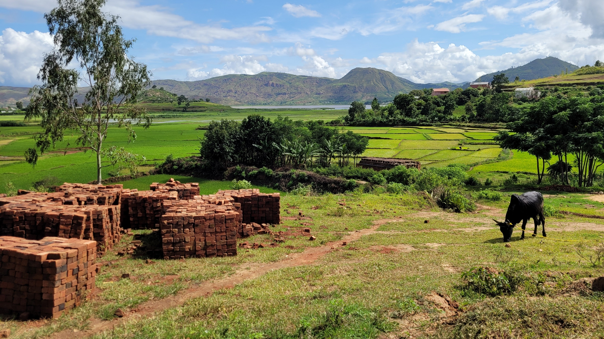
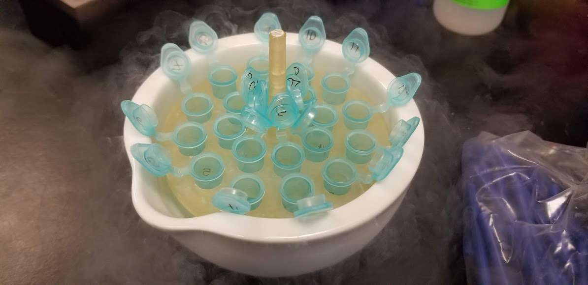

::: {.research-intro}
My research examines how environmental change shapes ecological and health outcomes across scales.

At broad spatial scales, I use models to predict species distributions, disease risk, and surveillance priorities. At local and community scales, I study how environmental disturbance, restoration, invasive species, and pollution reshape social-ecological systems. At the organismal scale, I examine how exposure, infection, and environmental stress shape physiological responses, resilience, and health outcomes.
:::

::: {.research-theme-grid}

::: {.research-theme-card}

::: {.research-theme-card-body}
### Spatial modelling for conservation and health

Species are not evenly distributed across landscapes, and neither are the risks, impacts, or uncertainties associated with them. My work uses spatial models to predict where species occur, where they may move next, and where additional surveillance can most improve decisions for conservation and public health.

<a href="projects.html#spatial-modelling-projects" class="theme-button">View projects</a>
:::
:::

::: {.research-theme-card}

::: {.research-theme-card-body}
### Environmental disturbance in social-ecological systems

Social-ecological systems emerge from reciprocal interactions among people, ecosystems, infrastructure, species, and environmental conditions. Human activity alters these systems in uneven and unexpected ways, reshaping habitats, interactions, and material flows. My work examines how disturbance, degradation, and restoration influence disease risk, well-being, and health across scales through a One Health lens.

<a href="projects.html#environmental-disturbance-projects" class="theme-button">View projects</a>
:::
:::

::: {.research-theme-card}

::: {.research-theme-card-body}
### Stress, resilience, and organismal responses

Changing environments place new demands on organisms, revealing both the flexibility and limits of biological response. My work examines how environmental stressors and infection shape physiology, life-history traits, resilience, vulnerability, and health outcomes across individuals and life stages.

<a href="projects.html#organismal-response-projects" class="theme-button">View projects</a>
:::
:::

:::