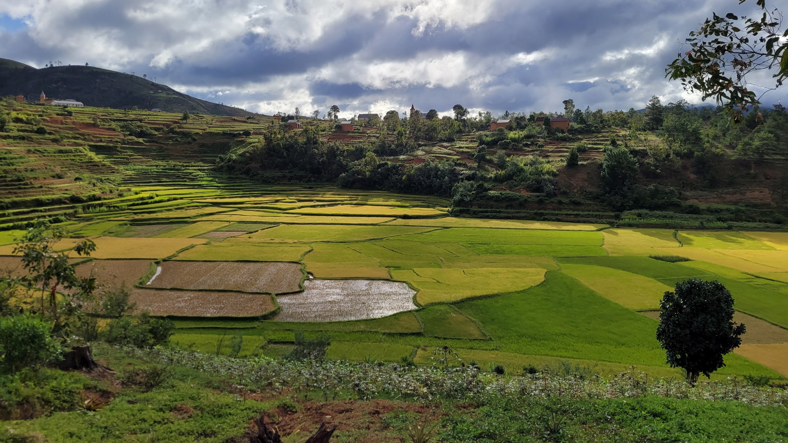

::: {.section-intro}
# Research

My research is organized around two guiding questions: how ecological change affects health, and how organisms respond under pressure. Together, these themes connect freshwater ecology, disease systems, spatial modeling, biological response, public health, and environmental change.
:::

::: {.theme-card-grid}

::: {.theme-card}
## How does ecological change affect health?

{.theme-card-image}

Environmental change can reshape species interactions, freshwater systems, invasive species dynamics, and disease ecology. This work examines how changing ecosystems affect human, animal, and ecosystem health, with implications for monitoring, restoration, and intervention.

[View projects →](ecological-change-health.qmd){.card-link}
:::

::: {.theme-card}
## How do organisms respond under pressure?

{.theme-card-image}

Organisms, pathogens, cells, and people respond to stress in ways that shape survival, infection, treatment response, and health. This work connects physiological response, immune function, molecular pathways, life-history traits, and biological outcomes across scales.

[View projects →](organisms-under-pressure.qmd){.card-link}
:::

:::